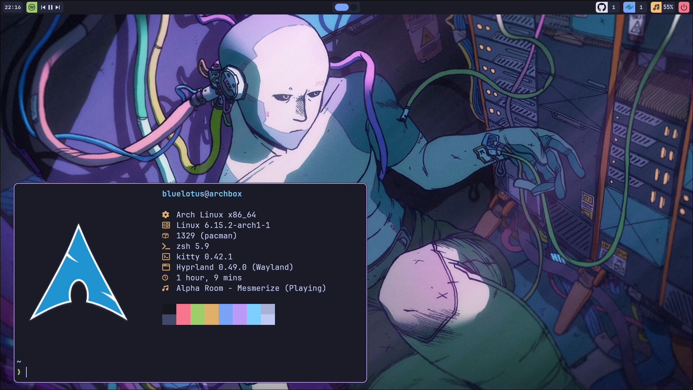
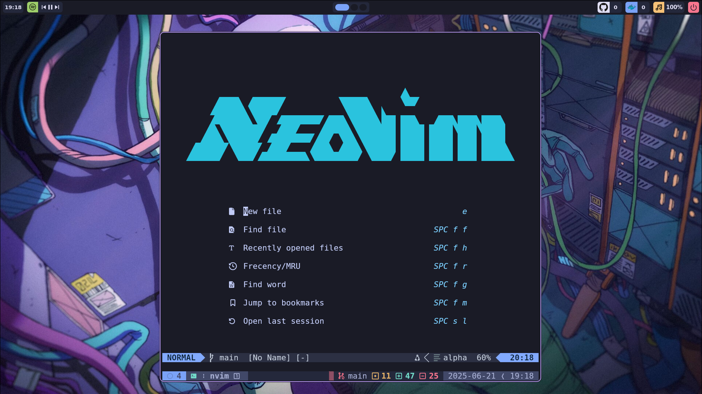

# Dotfiles

Development focused, easy to setup dotfiles



#### Todo

> - [ ] neovim, Debugger
> - [ ] finish swaync
> - [ ] eww launcher
> - [ ] install script
> - [ ] banana Cursor, fonts, icons ...
> - [ ] blinigify README

### Required

# Setup

```Bash
gnu stow .
chmod +x install.sh
./install.sh
```

# Hyprland

### Keybinds

# ZSH

### Navigation

Navigation is done by using vim keys: <br>
[zsh-vi-mode](https://github.com/jeffreytse/zsh-vi-mode)

### Keybinds

To find a specific entry in history file: <br>
ctrl + r<br>

For Suggestions<br>
press [TAB] and navigate with [TAB] through the suggestion

# Tmux

[prefix] = ctrl + b

#### non-default key-binds

##### navigation

alt + h - left<br>
alt + j - up<br>
alt + k - down<br>
alt + l - right<br>

##### resizing

alt + shift + h<br>
alt + shift + j<br>
alt + shift + k<br>
alt + shift + l<br>

##### menu

[prefix] + space - open menu

##### resurrect

[prefix] + Ctrl-s - save<br>
[prefix] + Ctrl-r - restore

#### plugins and Setup

- tpm
- tmux-sensible
- resurrect
- jaclu/tmux-menus

To manually install the plugin manager run

```bash
git clone https://github.com/tmux-plugins/tpm ~/.tmux/plugins/tpm
```

**install plugins**

```bash
tmux source-file ~/.tmux.conf
```

In side tmux press \_[prefix] + shift + i

# Neovim



### Plugins

will be added soon

### Linting and Formating

keep in mind to use :Mason to install linters and formatters

## Credits
